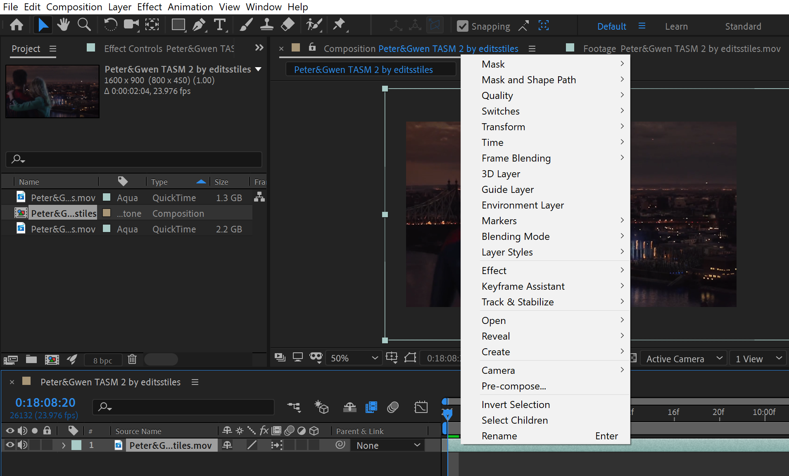
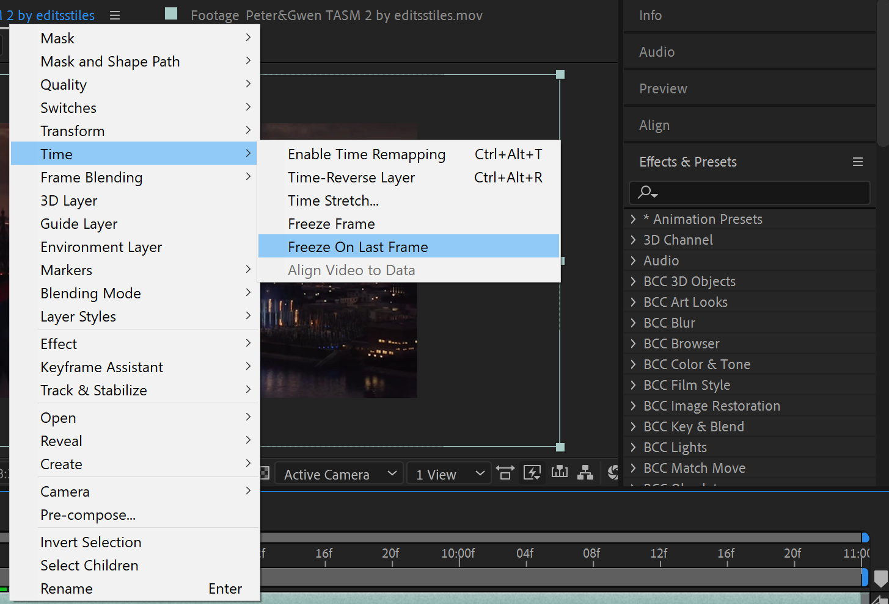
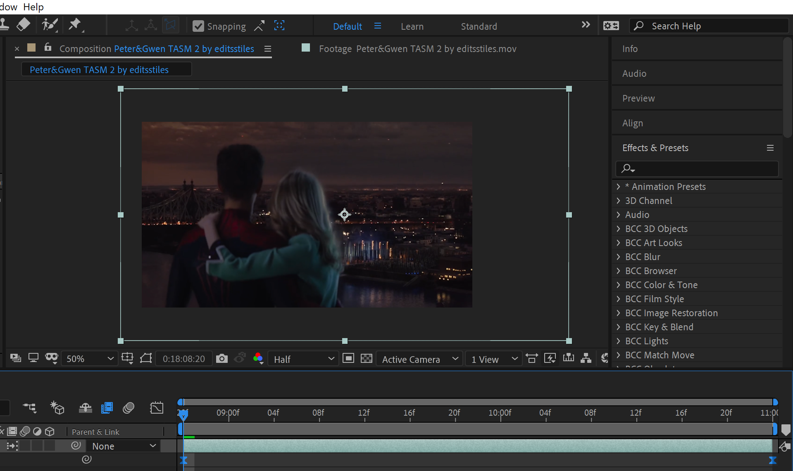
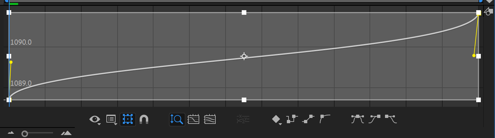

```{r setup, include=FALSE}
knitr::opts_chunk$set(echo = FALSE)
```
STEP ONE
{width=200}
When you load in your clip, you are going to want to locate the icon next to the fx icon and go below it and click it twice. When you first click it you should see a copy of the icon above; after your second click, you should see a different icon.

STEP TWO 
You are going slect your clip them, right click on your mouse and this should pop up:
{width=200}

Now that you see this you should press 'Time'. When you press time you well see many options and you will want to pick Freeze on Last Frame. It should look like this:
{width=200}

STEP THREE
After you do the previous step, you will see two keyframes on the bottom of your clip. You should move the last keyframe to the very end of the clip and press F9, this will allow you to use easy speed on the clip.
{width=200}

STEP FOUR
Now that you have your keyframes, you will want to create a graph, so you will go to the icons above the icons with fx and you are going to press the last one on your right. When you open the graph, select your keyframes and use this graph:
{width=200}

And that's it!